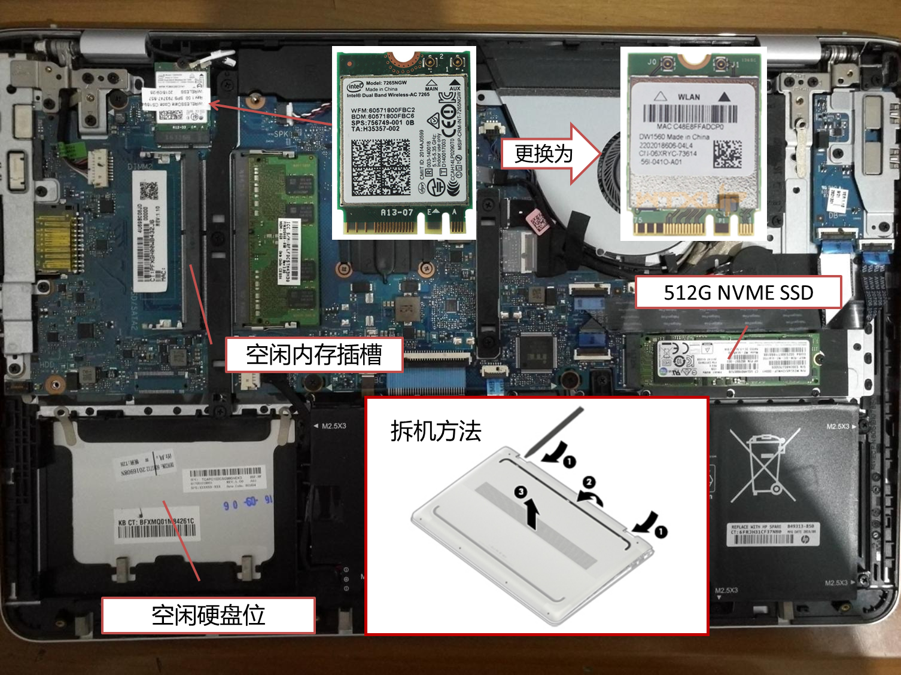

# HP ENVY - 15-as110tu for macOS Catalina 10.15.1/macOS Mojave 10.14.4/macOS High Sierra 10.13.6 
这是我使用的HP as110tu的Clover引导文件和驱动，完美程度99%了，目前还存在的问题：
* 可能电池有损耗，电量显示相差6%。
* 用AppleHDA Patcher给AppleHDA.kext打补丁的话，播放影音文件，有音频输出的时候，耳机插入才能识别。

著名的hackintosh论坛tonymacx86上的一个名为[7500U HD620 UHD laptop black screen after wake from sleep or display turned off](https://www.tonymacx86.com/threads/7500u-hd620-uhd-laptop-black-screen-after-wake-from-sleep-or-display-turned-off.214664/)的帖子开启了我的黑苹果之路，配置完善的过程主要是参考了黑果小兵的在github上的配置文件。

| 硬件     | 说明                                                                                       |
|----------|--------------------------------------------------------------------------------------------|
| 电脑型号 | HP ENVY - 15-as110tu                                                                       |
| 操作系统 | macOS Catalina 10.15.1/macOS Mojave 10.14.4/macOS High Sierra 10.13.6                       |
| CPU      | i7-7500U(Kaby Lake)                                                                        |
| 显示屏   | LG 15.6" diagonal UHD IPS UWVA multitouch-enabled edge-to-edge glass (3840 x 2160)         |
| 核显     | Intel® HD Graphics 620                                                                     |
| 硬盘     | Samsung PM961 Polaris 512GB M.2 NGFF PCIe Gen3 x 4                                         |
| 声卡     | Conexant HDA CX8200                                                                        |
| 无线网卡 | Intel 7265更换为Broadcom DW1560 BCM94352Z NGFF M2 - Supports WiFi/ac and BT4LE(5NGW带蓝牙) |
| 蓝牙     | Broadcom 20702A3(网卡自带)                                                                 |
| 读卡器   | Realtek SD card readers                                                                    |
| USB接口  | 3个USB 3.0接口                                                                             |
| 触摸板   | Synptics                                                                                   |

## 拆机图

## CLOVER
* 支持macOS Catalina 10.15.1/macOS Mojave 10.14.4/macOS High Sierra 10.13.6
* CPU原生支持，变频正常
* 睡眠唤醒正常
* 显卡原生支持，采用Lilu+WhateverGreen通过Clover/device/Properties方式注入，同时支持HDMI显示输出
* 声卡为Conexant HDA CX8200，可以使用 AppleALC 仿冒，layout-id:3或者21，通过Clover/device/Properties方式注入，支持HDMI Audio声音输出，但是插入耳机并不会自动切换，需要使用ALCPlugFix来修复，用AppleHDA Patcher给原生的AppleHDA.kext打补丁方式操作更简单，但是每次系统更新都需要重新打补丁。
* 无线网卡更换为DW1560 bcm94352z，不存在的睡眠唤醒后蓝牙失效的问题
* 显示器亮度调节正常；亮度调节快捷键：VoodooPS2Controller.kext(fn+F2/F3) ApplePS2SmartTouchPad.kext(Shift+Cap Lock+F2/F3)
* HDMI输出正常，采用Hackintool生成输出接口映射补丁
* 触摸屏能驱动，支持双指捏合缩放手势。
* 添加hdmi2.0补丁（根据网友su-shi提示）

## ACPI/patched目录说明
| 文件      | 说明                                                               |
|----------|--------------------------------------------------------------------|
| DSDT.aml | 补丁如下：                                                           |
|          | - modify _Q13 method to enable F2/F3 brightness control.  （小太阳） |
|          | - VoodooI2C-Patches [Windows] Windows 10 Patch            （触摸屏） |

## kexts（驱动）目录说明
| 文件                       | 说明                                                                                                          |
|----------------------------|--------------------------------------------------------------------------------------------------------------|
| ACPIBatteryManager.kext    | 电源驱动，用于正常显示电量                                                                                       |
| AirportBrcmFixup.kext      | 无线网卡驱动，在config.plist启动参数中添加brcmfx-country=(US,CN,#a)更改国家代码                                     |
| AppleALC.kext              | 声卡驱动                                                           |
| ApplePS2SmartTouchPad.kext | 键盘，触摸板和鼠标驱动，支持对驱动进行定制，操作体验更接近白苹果，但有Bug，睡醒后鼠标左键变右键               |
| VoodooPS2Controller.kext   | 通用键盘，触摸板和鼠标驱动，功能虽少，但使用很稳定                                                            |
| BrcmFirmwareData.kext      | 配合BrcmPatchRAM3.kext驱动蓝牙                                                                                |
| BrcmPatchRAM3.kext         | 如果卡在Fail to write to pulk pipe，需要添加启动参数dart=0以及Drop掉DMAR表，这个与VT-d虚拟技术有关。          |
| BrcmBluetoothInjector.kext | macOS Catalina的蓝牙驱动                                       |
| FakeSMC.kext               | 黑苹果必备                                                                                                    |
| Lilu.kext                  | 黑苹果必备                                                                                                    |
| WhateverGreen.kext         | 核显驱动                                                                                                      |
| VoodooI2C.kext             | 触摸屏驱动1，需要删除S/L/E中AppleHPM.kext，AppleIntelLpssI2C.kext，AppleIntelLpssI2CController.kext的三个驱动 |
| VoodooI2CHID.kext          | 触摸屏驱动2                                                                                                   |
| USBInjectAll.kext          | USB接口驱动                                                                                                   |
| Sinetek-rtsx.kext          | Realtek读卡器驱动                                                                                             |
| CPUFriend.kext             | CPU变频驱动                                                                                                   |
| CPUFriendDataProvider.kext | i7-7500U的CPU变频数据                                                                                         |
| HWPEnabler.kext            | Intel Speed Shift Technology                                                                                  |
| HDAEnabler.kext            | AppleHDA Patcher生成的补丁，另外打过补丁的AppleHDA.kext需要复制到S/L/E中覆盖原来的驱动                        |
| HoRNDIS.kext               | Android USB共享网络                                                                                           |
| NoTouchID.kext             | 禁止TouchID 的检测                                                                                           |

## 更新说明
2019-11-15
* 更新无线网卡、AppleALC.kext、Lilu.kext以及WhateverGreen.kext等驱动以适配最新版macOS Catalina

## 参考文章
1. [Dell Inspiron 7000 Clover配置文件](https://github.com/daliansky/dell7000)
2. [Dell-3443黑苹果配置文件](https://github.com/kkzzhizhou/Dell-3443-Hackintosh)
3. [小米PRO Clover配置文件](https://github.com/daliansky/XiaoMi-Pro)
4. [小白都能看懂的DSDT电量显示补丁教程](http://xiegengcai.github.io/2018/05/05/how-to-create-battery-dsdt-fix/)
